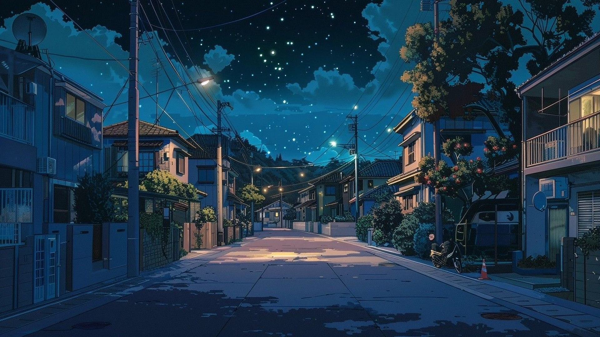

# Omarchy Japan Night Theme

A dark anime night theme for [Omarchy](https://omarchy.org/) — Japanese night
cityscapes with a deep ocean-blue palette extracted from the wallpapers.



## Wallpapers

- **8a74649785db30a59636dd01602f1d60.jpg** — empty city street at night with
  stars over buildings and trees (original)
- **8bf2187d7280c782990e65cebea806b0.jpg** — anime city street at night with
  the moon (original)
- **p1.jpg** / **p2.jpg** — same scenes with slightly reduced brightness

## Installation

Requires an Omarchy installation. Install and apply the theme in one command:

```bash
omarchy theme install https://github.com/devgtv/omarchy-japan-night-theme.git
```

Or, from a terminal:

```bash
# Clone to ~/.config/omarchy/themes/japan-night and apply automatically
omarchy theme install git@github.com:devgtv/omarchy-japan-night-theme.git
```

The theme is applied automatically after install. To apply it manually later:

```bash
omarchy theme set japan-night
```

## What gets themed

Running `omarchy theme set japan-night` generates color configurations for:

- **Terminals** — Alacritty, Foot, Kitty, Ghostty
- **Neovim / LazyVim** — via the `aether.nvim` colorscheme with the Japan
  Night palette
- **btop, helix, vscode, obsidian, tmux**
- **Omarchy shell** — bar, widgets, notifications
- **GTK / Qt** apps, Firefox, Zen, Discord, Spotify, Steam and more

## Customization

Backgrounds for this theme (stock or custom) can be added to
`~/.config/omarchy/backgrounds/japan-night/` or the theme directory
`~/.config/omarchy/themes/japan-night/backgrounds/`, then cycle with:

```bash
omarchy theme bg next
```

## Credits

Wallpapers sourced from Pinterest — see the [original pin
1](https://br.pinterest.com/pin/1050464681823407082/) and [original pin
2](https://br.pinterest.com/pin/698198748471118783/). Moonlit city street art
credited to [IAMAG on Twitter](https://twitter.com/iamagco).